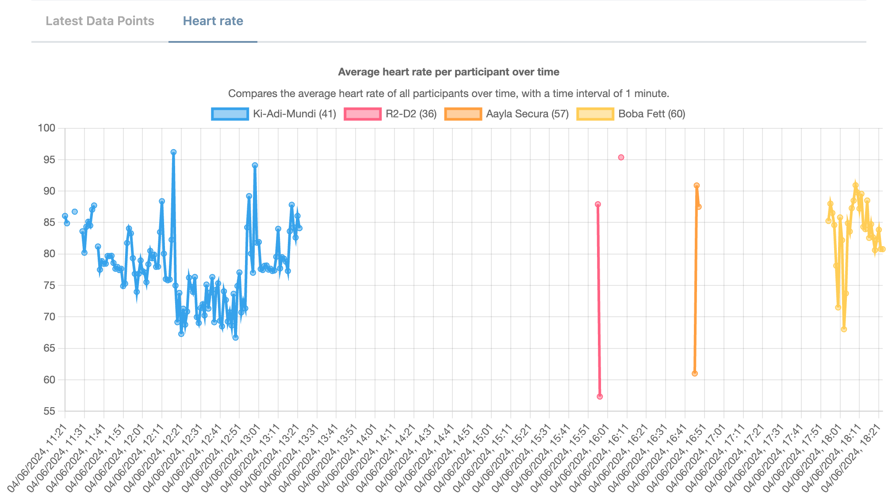

# More Studymanager Observation

## Data Preview

### How to extend a given observation to show different visualisations
If you want to modify existing data views for observations or want to add a new data view for a specific observation,
you need to edit the corresponding observation file under `studymanager-observation/src/main/java/io/redlink/more/studymanager/component/observation`

Each Observation (e.g. `PolarVerityObservation` or `QuestionObservation`) has two methods which are necessary for the data view.
- `listViews` (Returns an array of DataViewInfo objects, which represents all possibilities to show observation data)
- `getView` (Returns a specific DataView based on the given parameters)

A `private enum DataViewInfoType` defines all possible types as DataViewInfoType and needs to be implemented in the
corresponding `*Observation.java` file. The name of an enum type is the identifier of a specific view,
which you need for the request, when you want to receive the data for this DataView.

In the DataViewInfoType, you need to define some information about the data view:
- The translation keys for the label, title and description. These keys needs to be defined in the studymanager-frontend Repository as well (in de.json and en.json)
- The chartType (one type of DataView.ChartType enum) which represents the visual representation (e.g. Pie, Bar or Line)
- The viewConfig which defines how the data will be fetched and aggregated from elastic search

#### ViewConfig (detailed explanation)
1. The first argument of a ViewConfig record is a List of filters, where you can additionally define filters, which are applied in the elastic query later on (not yet implemented, because currently not needed).
2. The second argument of a ViewConfig record is an Aggregation, where you can define which data points should be shown. The Aggregation can be one of the enum values (e.g. TIME, STUDY_GROUP, PARTICIPANT or TERM_FIELD).
3. The third argument of a ViewConfig record is an Aggregation as well, where you can define the aggregation for the x-axis.
4. The fourth argument of a ViewConfig record is an Operation, where you can define which aggregation function (e.g. AVG, COUNT, SUM) should be applied on which field (e.g. "hr"), which then represents the y-axis.

#### Example (PolarVerityObservation)
When you request the API endpoint `/studies/{studyId}/observations/{observationId}/views` with the corresponding studyId and observationId (for the Polar Verity Sensor),
you'll get back a list of all possible views, in this case `["heart_rate"]`.
Now you can fetch the observation data view information with the API endpoint `/studies/{studyId}/observations/{observationId}/views/{viewName}`, where `viewName` is `heart_rate`.

Explanation of the example screenshot below (chart in the Frontend):
- "Heart rate" shown as a Tab in the FE, is the "label" defined in `DataViewInfoType`
- "Average heart rate per part..." shown as the title of the chart, is the "title" defined in `DataViewInfoType`
- "Compares the average heart rate of all ..." shown under the title of the chart, is the "description" defined in `DataViewInfoType`
- Each participant alias is shown in the chart legend, and its query definition is defined in the `ViewConfig.rowAggregation`
- The query definition for the x-axis labels (time) is defined in the `ViewConfig.seriesAggregration`
- The values (y-axis) for each participant is the average heart rate over time and its query definition is defined in the `ViewConfig.Operation`, where you need to define the corresponding observation data (e.g. "hr") and operation type (e.g. `ViewConfig.Operator.AVG`)

